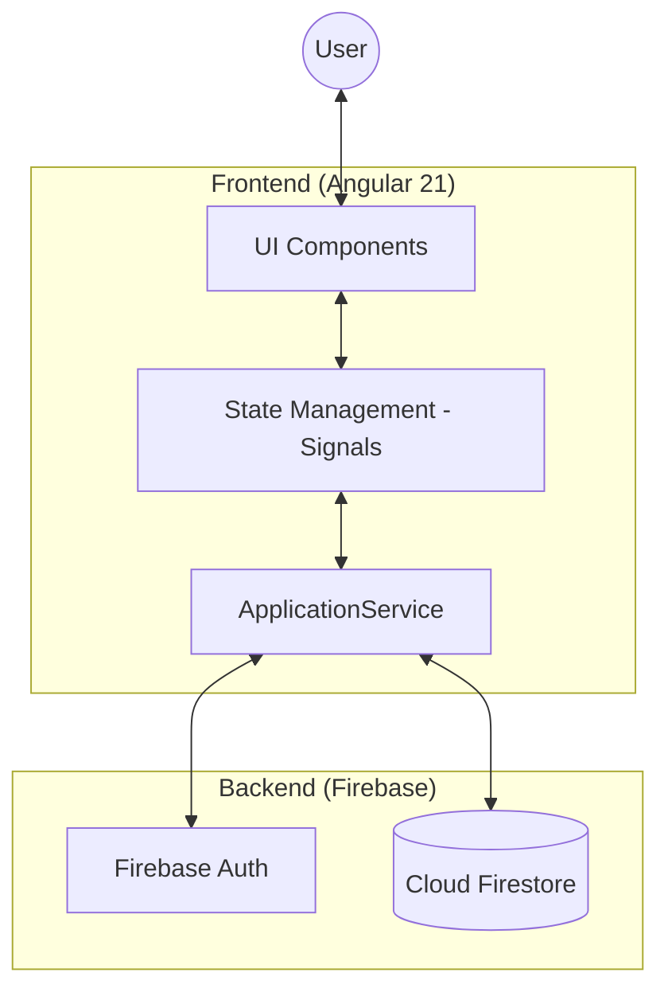
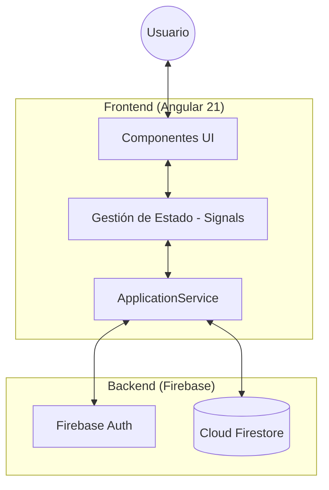

# JobQuest - Job Application Tracker

[🇺🇸 English](#english) | [🇪🇸 Español](#español)

---

## 🇺🇸 English

> **Visual dashboard to track your job search journey. Monitor applications, interviews, offers, and rejections in one place.**

### Features
- 📊 **Interactive Dashboard** - Visualize your job search progress with charts
- 📋 **Kanban Board** - Drag & drop applications through stages
- 🔐 **Serverless Authentication** - Firebase Auth secure user accounts
- 🌓 **Dark/Light Mode** - Adaptive theme based on preference
- 🌍 **Multi-language** - English and Spanish support
- 📤 **Export Data** - CSV export localized by language

### Tech Stack
| Layer | Technology |
|-------|------------|
| **Frontend** | Angular 21, TypeScript, RxJS, Lucide Icons |
| **Backend & DB** | Firebase Auth + Cloud Firestore (NoSQL) |
| **Deployment** | Vercel (static frontend) |
| **Icons** | Lucide Icons |

### 🏗️ Architecture & Design

The project follows a **Serverless SPA** architecture, prioritizing real-time reactivity and maintainability.

#### System Overview

#### Key Design Decisions
- **Signals-based Reactivity**: Leverages Angular Signals for fine-grained UI updates, reducing overhead compared to traditional RxJS Observables for component state.
- **Real-time Sync**: Uses Firestore `onSnapshot` to ensure the Dashboard and Kanban board are always in sync across devices without manual refreshes.
- **Decoupled Business Logic**: All Firestore interactions and data mapping (like converting Timestamps to Dates) are encapsulated within the `ApplicationService`.

### 🚀 Deployment 
Your app is a fully static SPA that connects directly to Firebase and is deployed in Vercel.

### Version History
- **[1.5.0] (2026-05-16)** - Added comprehensive Architecture & Design documentation with Mermaid diagrams.
- **[1.4.1] (2026-05-10)** - Mobile UI enhancements: expanded form sizes for better readability and touch targets.
- **[1.4.0] (2026-05-10)** - Added Smart Loading Screen for Firebase Auth state transitions, improved UX and fixed route race conditions.
- **[1.3.0] (2026-05-10)** - Complete Serverless migration. Replaced Node.js backend with Firebase Auth + Firestore.
- **[1.2.0]** - Multi-language CSV Export & Date Field.
- **[1.0.0]** - Initial Release.

---

## 🇪🇸 Español

> **Panel visual para gestionar tu búsqueda de empleo. Monitorea postulaciones, entrevistas, ofertas y rechazos en un solo lugar.**

### Funcionalidades
- 📊 **Panel Interactivo** - Visualiza el progreso de tu búsqueda de trabajo con gráficos
- 📋 **Tablero Kanban** - Arrastra y suelta postulaciones por distintas etapas
- 🔐 **Autenticación Serverless** - Cuentas de usuario seguras con Firebase Auth
- 🌓 **Modo Oscuro/Claro** - Tema adaptable según tu preferencia
- 🌍 **Multi-idioma** - Soporte nativo para Inglés y Español
- 📤 **Exportar Datos** - Exportación a CSV traducida según el idioma seleccionado

### Tecnologías
| Capa | Tecnología |
|-------|------------|
| **Frontend** | Angular 21, TypeScript, RxJS, Lucide Icons |
| **Backend y BD** | Firebase Auth + Cloud Firestore (NoSQL) |
| **Despliegue** | Vercel (frontend estático) |
| **Iconos** | Lucide Icons |

### 🏗️ Arquitectura y Diseño

El proyecto sigue una arquitectura de **SPA Serverless**, priorizando la reactividad en tiempo real y la facilidad de mantenimiento.

#### Vista General del Sistema

#### Decisiones Técnicas Clave
- **Reactividad con Signals**: Uso de Angular Signals para actualizaciones de UI granulares, simplificando la gestión de estado comparado con RxJS tradicional.
- **Sincronización Live**: Implementación de `onSnapshot` de Firestore para garantizar que el Dashboard y el Kanban estén siempre actualizados.
- **Lógica Desacoplada**: Todas las interacciones con la base de datos y el mapeo de modelos están encapsulados en servicios, manteniendo los componentes limpios y enfocados en la UI.

### 🚀 Despliegue 
Esta aplicación es una SPA estática que se conecta directamente a Firebase yy está desplegada en Vercel.

### Historial de Versiones
- **[1.5.0] (2026-05-16)** - Se añadió documentación completa de Arquitectura y Diseño con diagramas Mermaid.
- **[1.4.1] (2026-05-10)** - Mejoras de UI en móvil: se amplió el tamaño de los formularios para mejor legibilidad y usabilidad.
- **[1.4.0] (2026-05-10)** - Pantalla de carga inteligente para transiciones de Firebase Auth, UX mejorada y corrección de bloqueos de rutas.
- **[1.3.0] (2026-05-10)** - Migración completa a Serverless. Se reemplazó el backend en Node.js por Firebase Auth + Firestore.
- **[1.2.0]** - Exportación CSV Multi-idioma y campo de Fecha.
- **[1.0.0]** - Lanzamiento Inicial.
